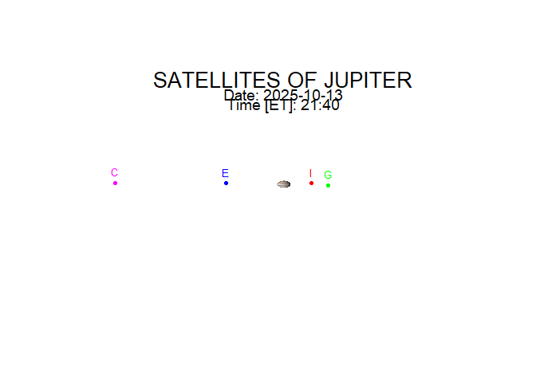

<!-- README.md is generated from README.Rmd. Please edit that file -->

# galisats

<!-- badges: start -->

[](https://github.com/LechJaszowski/galilean_satellites/actions/workflows/R-CMD-check.yaml)
<!-- badges: end -->

If you are looking at Jupiter through binoculars or a telescope and
don’t know which moon is which, then use this package.

`galisats` is used to determine the positions of the four greatest
satellites of Jupiter (called Galilean satellites). Positions are shown
on the plot for any given time (ET – Ephemeris Time) with respect to the
planet, as seen from the Earth.

The `galsat()` function calculates numerical values of the satellites’
positions:

x – the apparent rectangular coordinate of the satellite with respect to
the center of Jupiter’s disk in the equatorial plane in the units of
Jupiter’s equatorial radius; X is positive toward the west

y – the apparent rectangular coordinate of the satellite with respect to
the center of Jupiter’s disk from the equatorial plane in the units of
Jupiter’s equatorial radius; Y is positive toward the north

The function is based on algorithms in the book:

Astronomical Formulae for Calculators (4th edition), Jean Meeus,
Willmann-Bell Inc., 1988

## Installation

You can install the development version of galisats from \[GitHub\]
(<https://github.com/>) with:

``` r
# install.packages("devtools")
devtools::install_github("LechJaszowski/galilean_satellites")
```

## Example

This is an example of using the function galsat():

``` r
library(galisats)
galsat(2025, 10, 13, 21, 40)
#> [1] "SATELLITES OF JUPITER"
#> [1] "Positions of the Galilean satellites."
#> Date: 13 - 10 - 2025 
#> Time [ET]: 21 : 40 
#> [1] "x: West(+), East(-)"
#> Io        4.1 
#> Europa    -8.413 
#> Ganymede  6.636 
#> Callisto  -24.733 
#> [1] "y: North(+), South(-)"
#> Io        0.112 
#> Europa    0.108 
#> Ganymede  -0.352 
#> Callisto  0.254
```



    #>       moon          x          y
    #> 1       Io   4.099974  0.1122642
    #> 2   Europa  -8.412734  0.1083234
    #> 3 Ganymede   6.636258 -0.3519694
    #> 4 Callisto -24.733044  0.2537935
