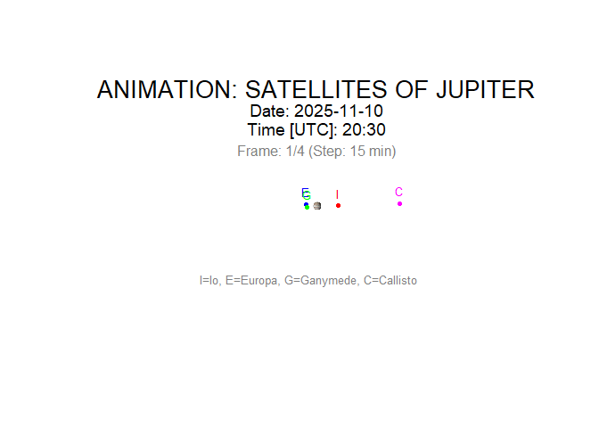
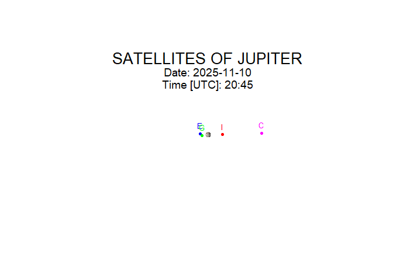
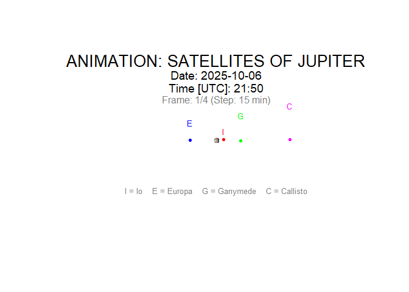
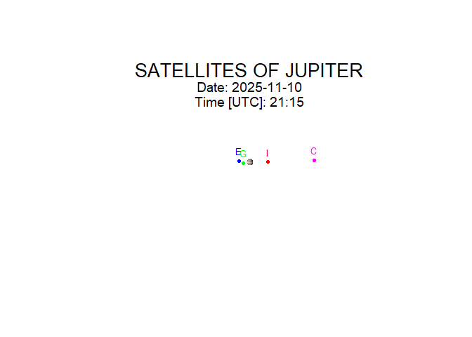

<!-- README.md is generated from README.Rmd. Please edit that file -->

# galisats <a href="https://lechjaszowski.github.io/galilean_satellites/"></a>

<!-- badges: start -->

[](https://github.com/LechJaszowski/galilean_satellites/actions/workflows/R-CMD-check.yaml)

<!-- badges: end -->

If you are looking at Jupiter through binoculars or a telescope and
don’t know which moon is which, then use this package.

`galisats` is used to determine the positions of the four greatest
satellites of Jupiter (called Galilean satellites). Positions are shown
on the plot for any given time (UTC – Coordinated Universal Time) with
respect to the planet, as seen from the Earth.

The `galsat()` function calculates numerical values of the satellites’
positions and draws them in rectangular coordinates:

x – the apparent rectangular coordinate of the satellite with respect to
the center of Jupiter’s disk in the equatorial plane in the units of
Jupiter’s equatorial radius; X is positive toward the west

y – the apparent rectangular coordinate of the satellite with respect to
the center of Jupiter’s disk from the equatorial plane in the units of
Jupiter’s equatorial radius; Y is positive toward the north

The function is based on algorithms in the book:

Astronomical Formulae for Calculators (4th edition), Jean Meeus,
Willmann-Bell Inc., 1988

The `galsat_animate()` function creates an animation of the Galilean
satellites’ positions. You provide the starting time, duration, the time
step between frames, and the pause between frames.

The `delta_t()` function returns the value of delta-T in seconds unit.
It’s useful for converting the Coordinated Universal Time (UTC) to the
Ephemeris Time (ET). The conversion is handled as: ET = UTC + deltaT

## Installation

You can install the development version of galisats from \[GitHub\]
(<https://github.com/>) with:

``` r
# install.packages("devtools")
devtools::install_github("LechJaszowski/galilean_satellites")
```

## Examples

There are examples of using `galsat()`, `galsat_animate()` and
`delta_t()` functions:

``` r
library(galisats)
galsat(2025, 10, 13, 21, 40)
```


    #>       moon          x          y u_corrected
    #> 1       Io   4.089507  0.1125276   136.36624
    #> 2   Europa  -8.417919  0.1080519   243.92834
    #> 3 Ganymede   6.644450 -0.3518624    26.35374
    #> 4 Callisto -24.735531  0.2536266   248.65218
    galsat_animate(2025, 10, 6, 21, 50, duration_hours = 1, time_step_minutes = 15)



``` r
delta_t(1999, 10)
#> [1] 63.78768
delta_t(c(-200, 1610, 2030), c(1, 10, 12))
#> [1] 12791.65348   107.80766    78.25045
```
