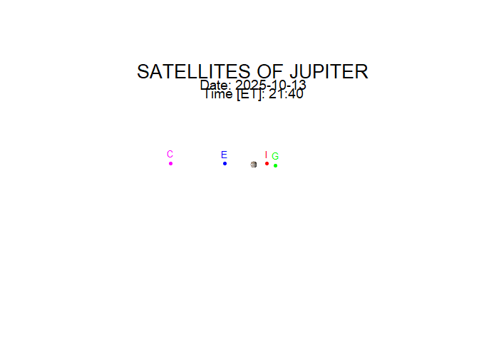

<!-- README.md is generated from README.Rmd. Please edit that file -->

# galisats

<!-- badges: start -->

<!-- badges: end -->

If you are looking at Jupiter through binoculars or a telescope and
don’t know which moon is which, then use this package.

galisats is used to determine the positions of the four greatest
satellites of Jupiter (called Galilean satellites). Positions are
calculated for any given time (ET – Ephemeris Time) with respect to the
planet, as seen from the Earth.

The galsat() function calculates numerical values of the satellites’
positions:

x – the apparent rectangular coordinate of the satellite with respect to
the center of Jupiter’s disk in the equatorial plane in the units of
Jupiter’s equatorial radius; X is positive toward the west

y – the apparent rectangular coordinate of the satellite with respect to
the center of Jupiter’s disk from the equatorial plane in the units of
Jupiter’s equatorial radius; Y is positive toward the north

The function is based on algorithms in the book:

Astronomical Formulae for Calculators (4th edition), Jean Meeus,
Willmann-Bell Inc., 1988

## Installation

You can install the development version of galisats from \[GitHub\]
(<https://github.com/>) with:

``` r
# install.packages("galisats")
# devtools::install_github("...")
```

## Example

This is an example of using the function galdraw():

``` r
library(galisats)
galdraw(2025, 10, 13, 21, 40)
#> [1] "SATELLITES OF JUPITER"
#> [1] "Positions of the Galilean satellites."
#> Date: 13 - 10 - 2025 
#> Time [ET]: 21 : 40 
#> [1] "x: West(+), East(-)"
#> Io        4.1 
#> Europa    -8.413 
#> Ganymede  6.636 
#> Callisto  -24.733 
#> [1] "y: North(+), South(-)"
#> Io        0.112 
#> Europa    0.108 
#> Ganymede  -0.352 
#> Callisto  0.254
```


